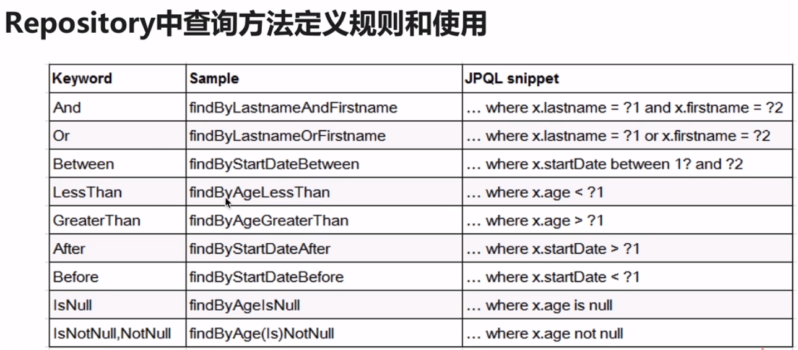
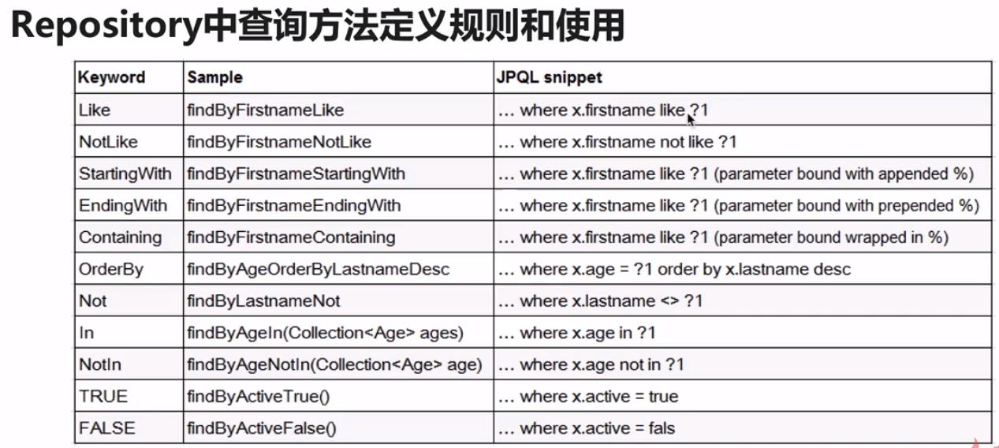
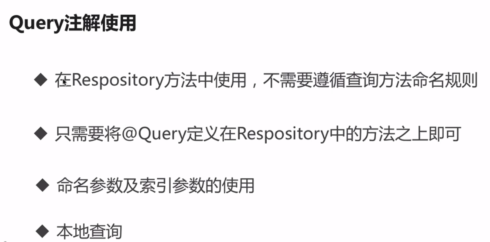
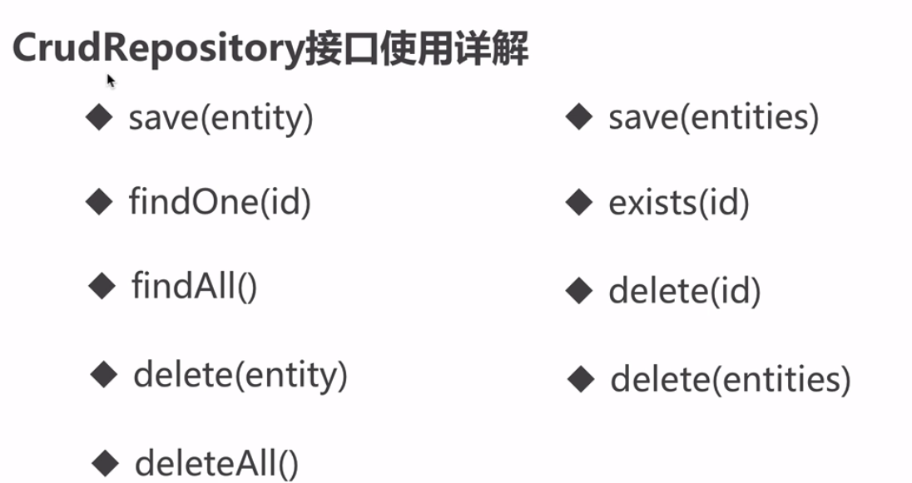
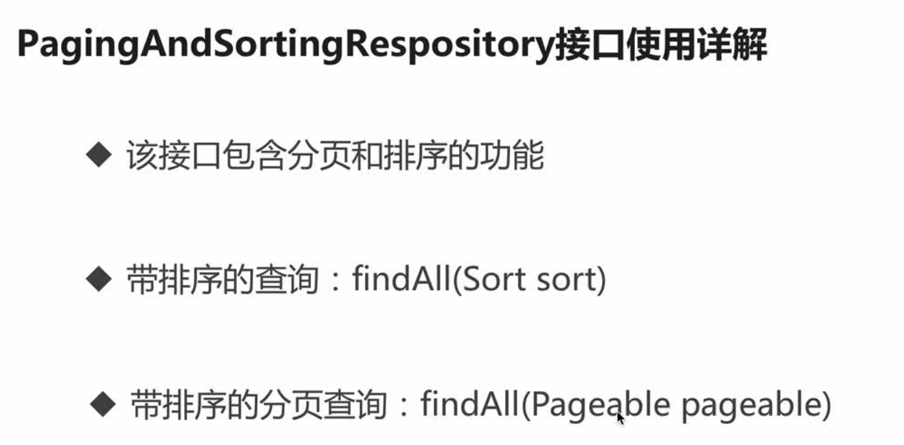
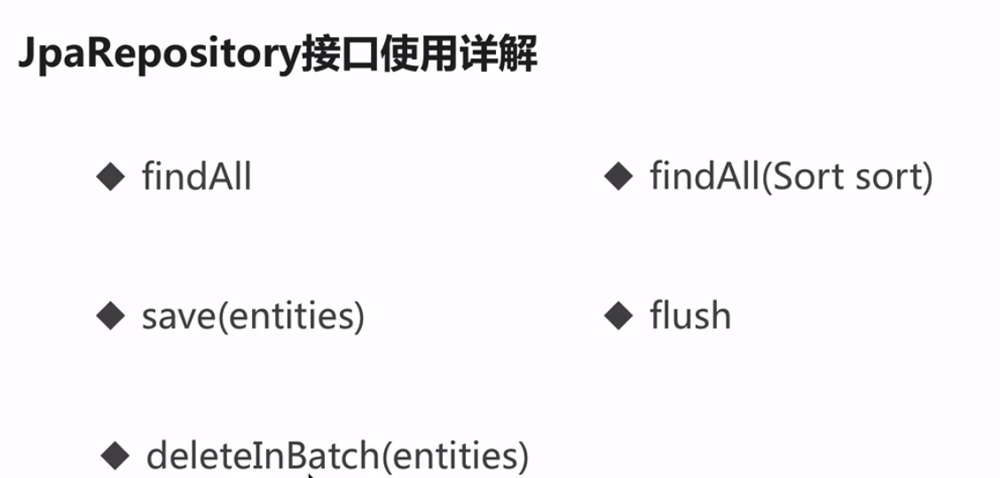

#Spring Data JPA
### Responsitory类的定义：
public interface Repository<T,ID extends Serializable>{}
1）Responsitory是一个空接口，标记接口
没有包含方法声明的接口
2）我们定义的接口 ** extends Repository，表示此接口纳入spring管理，需按一定规则定义方法

如果我们自定义的接口没有extends Repository运行时会报错：
org.springframework.beans.factory.NoSuchBeanDefinitionException:No qualifying bean of type 'com.lhf.spring.repository.**' available

3）添加注解能达到不用extends Repository的功能
@RepositoryDefinition(domainClass = **.class,idClass=Integer.class)

###Repository的子接口
1、CrudRepository:继承Repository，实现了CURD相关的方法    

2、PagingAndSortingRepository:继承CrudRepository,实现了分布排序相关方法    
 
3、JpaRepository:继承PagingAndSortingRepository，实现JPA规范相关的方法     

Repository规则：

对于按照方法命名规则来使用的话，有弊端：
1）方法名会比较长： 约定大于配置
2）对于一些复杂的查询，是很难实现

@Query

【更新及删除操作整合事务的使用】
1、@Modifying注解使用
2、@Modifying结合@Query注解执行更新操作
3、@Transactional在Spring Data中的使用
@Modifying
@Query("update o set o.age = :age where o.id=:id")
此上的操作需要事务
一般事务都是放在service中统一管理
在对应updat方法上添加@Transactional注解

事务在Spring data中的使用：
1）事务一般是在Service层
2）@Query、 @Modifying、@Transactional的综合使用